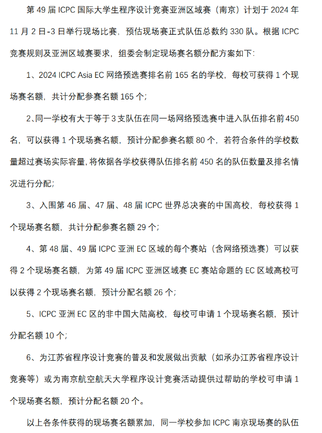

# 3.3. XCPC 比赛类别

XCPC是对包括ICPC、CCPC等在内的各类大学生程序设计竞赛的统称。这些比赛在层级、规模和含金量上有所区分，共同构成了大学生算法竞赛的生态体系。

从竞赛的普遍含金量和竞技水平角度来看，通常遵循以下层级关系：

**省赛 < 邀请赛 << 区域赛**

当然，具体情况需具体分析，某些特定省份的省赛（例如：北京地区的省赛），因其较高的题目难度和激烈的竞争，其含金量和认可度也会相应提升。

此外，在更高层级还存在 **CCPCF（CCPC总决赛）**、**ECF（亚洲区总决赛，如ICPC亚洲区决赛）**、以及全球最高级别的 **WF（ICPC世界总决赛）** 等赛事。这些比赛通常面向顶尖队伍，与初学者（萌新）的直接关联度较低，但它们是算法竞赛的终极目标。

以下将对主要比赛类别进行详细介绍：

## 省赛

省赛通常是各省份或直辖市内部举办的大学生程序设计竞赛，是许多高校队伍初次接触正式比赛的平台。

- **参赛范围：** 主要面向本省或本直辖市范围内的高校队伍。非本省高校的队伍通常只能以“打星队”身份参赛，不参与正式排名和奖项评定。
- **名额分配：** 省赛的名额通常比较充裕，多数情况下只要符合基本条件，报名即可获得参赛资格。这为新生和初级队伍提供了良好的入门机会。
- **晋级关联：** 如果省赛的主办学校同时也是某区域赛的承办方，该区域赛组委会可能会根据省赛的成绩表现，向参赛队伍发放部分区域赛的推荐名额或优先报名资格。

##  邀请赛

邀请赛通常由特定高校或机构主办，其参赛队伍范围更广，竞争也更为激烈。

- **参赛范围：** 全国范围内的各大高校队伍均可正式报名参赛。
- **名额分配：** 邀请赛的名额通常较为有限且宝贵，因为希望参赛的队伍数量往往远超赛场容量。根据各主办方规则进行发放。例如完全根据报名先后顺序发放，或优先保证每个学校至少有一个参赛名额进行发放等方式。
- **晋级关联：** 类似于省赛，如果邀请赛的主办学校也是区域赛的承办方，邀请赛的成绩也可能被用作发放区域赛推荐名额或优先报名资格的依据。

## 区域赛

区域赛是XCPC体系中承上启下的关键赛事，也是绝大多数参赛选手所追求的最高荣誉（如金、银、铜牌）的主要来源。

- **赛事定位：** 区域赛是晋级世界总决赛的必经之路。通常而言，大家所提及的“ACM金银铜牌”或“XCPC金银铜牌”，默认指的都是在区域赛中获得的奖项。
- **网络赛：** 区域赛之前通常会举行“网络选拔赛”（简称网络赛）。网络赛的成绩与区域赛的参赛名额关联度极高，是获得区域赛正式参赛资格的主要途径。
  - **ICPC区域赛：** 通常需要参加两场网络赛（例如：ICPC Online Round 1 和 Online Round 2），以其综合成绩决定晋级资格。
  - **CCPC区域赛：** 通常设置一场网络区预赛作为主要的选拔依据。
  - **难度：** 事实上，由于网络赛面向全国范围内的队伍，且名额竞争激烈，在网络赛中打出晋级区域赛的名额，其难度往往不亚于甚至高于在区域赛中获奖。

### 名额分配

以[2024年南京站](https://icpc.pku.edu.cn/tzgg/161009.htm)为例

### 报名流程

以[2024年南京站](https://icpc.pku.edu.cn/tzgg/161577.htm)为例

### 外卡

外卡机制为那些在网络赛中表现不佳但仍具备一定实力或特殊情况的队伍提供了额外进入区域赛的机会。

- **获取方式：** 区域赛的主办方通常会预留一定数量的“外卡名额”。如果某支队伍（通常是学校队伍）未能通过网络赛获得正式参赛资格，但具备充分且具有说服力的理由，可以向主办方提交外卡申请。
- **申请理由：** 合理的外卡申请理由可能包括：
  - 学校首次组队参加CCPC，且具备一定的培养潜力（例如，CCPC通常会优先考虑首次参赛学校的外卡申请）。
  - 队伍在其他大型比赛中表现突出，但因偶然因素在网络赛中失利。
  - 学校在算法竞赛领域投入较大，旨在推广和普及相关活动。
- **申请结果：** 外卡的最终发放由主办方根据实际情况和申请理由的充分性进行综合评估和决定。获得外卡通常意味着获得了正式参赛资格。
