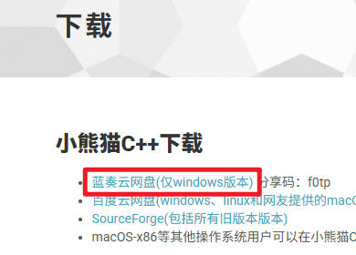
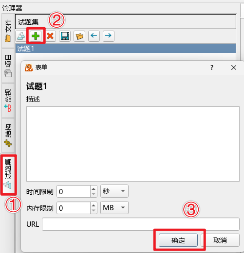
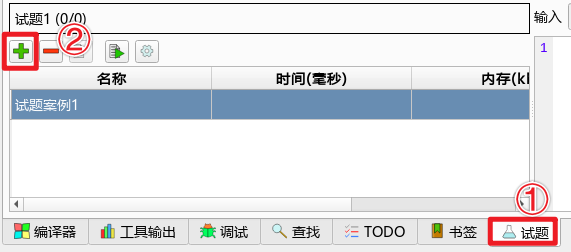
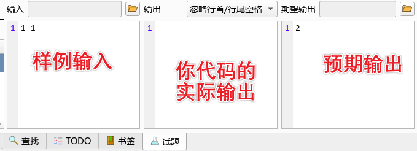
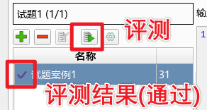

# 6.1. 小熊猫C++

是下文的dev c++的上位替代品，如果是刚刚入门的选手那么我推荐你安装个小熊猫C++就够了，因为它的安装与运行十分简单。

下载链接：[小熊猫C++](http://royqh.net/redpandacpp/download/)

点击`蓝奏云网盘(仅windows版本) 分享码：f0tp`下载即可，下载后缀是`win64.MinGW64_xx.x.x.Setup.exe`的文件

> 特征在于，中间是`win64.MinGW64`、末尾是`.exe`。如果你的电脑是32位的，下载中间是`win32.MinGW32`的即可。
> 
> 如果你**不懂**什么是32位什么是64位，那么你的电脑肯定是**64位**的，下载`win64.MinGW64`的版本即可

下载完成后点击安装，所有过程无脑下一步即可。注意**安装路径**里面千万**不能有中文**，否则会导致无法使用，最好就**别改安装路径**！！！

安装完成后使用 `ctrl + n` 新建文件

写好代码后按 `F11` 便可以实现编译运行代码

可以在顶部菜单`工具->选项`内进行各种外观设置。

在选项设置窗口中的`编辑器->杂项`可以设置`保存前动作`为`重新排版`，小熊猫C++会在你每次保存后自动整理代码。也有专门的代码排版设置区，可以完全自定义代码排版规则。

`编辑器->代码模板`内可以自定义`C文件模板`、`C++文件模板`，这样子新建文件会自动拥有初始的板子代码，方便打线上赛。

主界面左侧有`试题集`选项卡，点开后点击`绿色+号`创建，直接点击确定。

然后底部有`试题`选项卡，点开后在底部左侧的试题控制面板点击`绿色+号`创建试题。

然后右侧的第一个编辑框可以粘贴`样例输入`，右侧最后一个编辑框可以粘贴`预期输出`。

最后在左侧面板点击`文件和绿色三角形`图标启动评测，即可很方便的在本地评测，再也不需要每次都手动编译运行粘贴样例了。

> 如果你要打XCPC，建议在比赛前一两周和队友集体学习下`Clion`的使用(下文会介绍)。这是因为赛场是没有小熊猫C++的，只有`VS Code`和`Clion`；而部分赛点的`VS Code`无插件，处于残废状态；这时`Clion`可以保证你的代码体验不受影响。
